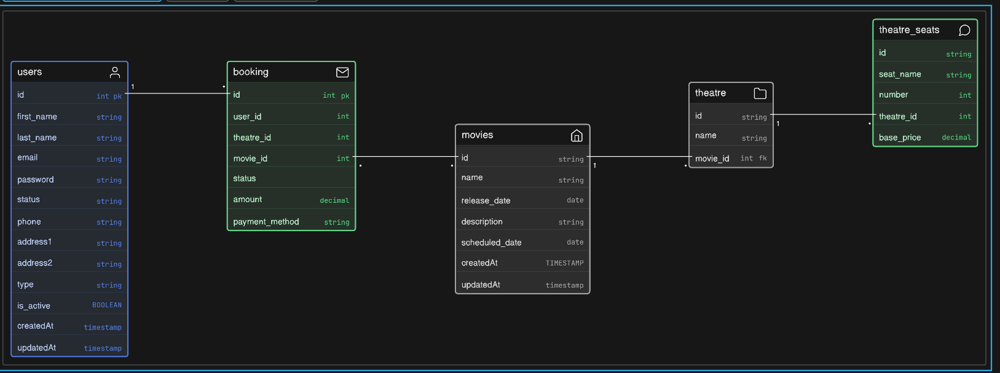

# Movie Booking System

A beginner-level movie booking system with user authentication, movie management, theatre allocation, and secure seat booking.

## Features

- **Login/Authentication Module** - User registration and login functionality
- **Movie Management** - Store and manage movie information
- **Theatre Management** - Each movie can have multiple theatres
- **Seat Management** - Theatre seats with pricing
- **Booking System** - Users can book seats with concurrency protection
- **Concurrency Control** - Prevents double-booking when multiple users try to book the same seat
- **Payment Processing** - Track payment methods and amounts

## Modules

1. **Users** - User authentication and profile management
2. **Movies** - Movie catalog and scheduling
3. **Theatres** - Theatre information linked to movies
4. **Theatre Seats** - Seat allocation and pricing
5. **Booking** - Booking transactions and status tracking

## Database Schema

### Users Table

```
users {
  id              INT PRIMARY KEY
  first_name      STRING
  last_name       STRING
  email           STRING
  password        STRING
  status          STRING
  phone           STRING
  address1        STRING
  address2        STRING
  type            STRING
  is_active       BOOLEAN
  createdAt       TIMESTAMP
  updatedAt       TIMESTAMP
}
```

### Movies Table

```
movies {
  id              STRING PRIMARY KEY
  name            STRING
  release_date    DATE
  description     STRING
  scheduled_date  DATE
  createdAt       TIMESTAMP
  updatedAt       TIMESTAMP
}
```

### Theatre Table

```
theatre {
  id              STRING PRIMARY KEY
  name            STRING
  movie_id        INT FOREIGN KEY -> movies.id
}
```

### Theatre Seats Table

```
theatre_seats {
  id              STRING PRIMARY KEY
  seat_name       STRING
  number          INT
  theatre_id      INT FOREIGN KEY -> theatre.id
  base_price      DECIMAL
}
```

### Booking Table

```
booking {
  id              INT PRIMARY KEY
  user_id         INT FOREIGN KEY -> users.id
  theatre_id      INT FOREIGN KEY -> theatre.id
  movie_id        INT FOREIGN KEY -> movies.id
  status          STRING
  amount          DECIMAL
  payment_method  STRING
}
```

## Relationships

- `users.id` → `booking.user_id`
- `movies.id` → `theatre.movie_id`
- `theatre.id` → `theatre_seats.theatre_id`
- `movies.id` → `booking.movie_id`
